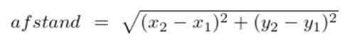

# Oefentoets 2

## Vraag 1

Schrijf een programma waarin de gebruiker drie getallen kan invullen.
Print vervolgens het middelste (qua grootte) getal.

Voorbeeld:

```
Getal 1: 7
Getal 2: 92
Getal 3: 23
```

## Vraag 2

Schrijf een programma waarin een gebruiker getallen moet invoeren.
Dit gaat door totdat de gebruiker 'stop' intoetst.
De getallen moeten met elkaar vermenigvuldigd worden.
Print het resultaat.

Voorbeeld:
```
Voer een getal in: 9
Voer een getal in: 2
Voer een getal in: 4
Voer een getal in: 1
Voer een getal in: stop
Als je deze getallen vermenigvuldigd, is het resulaat: 72
```

## Vraag 3
De afstand tussen twee coordianten kun je uitrekenen met de volgende formule:

Let op: worteltrekken doe je met ```math.sqrt()``` of machtsverheffen met exponent 0.5
Schrijf een programma waarin de gebruiker twee coordinaten moet invoeren.
Print de afstand (afgerond op 4 decimalen)

Voorbeeld:
```
X-positie van coordinaat 1 (x1): 1
Y-positie van coordinaat 1 (y1): 5
X-positie van coordinaat 2 (x2): 3
Y-positie van coordinaat 2 (y2): 4
Afstand tussen de coordinaten (1,5) en (3,4): 2.2361
```

## Vraag 4
Schrijf een programma waarin je de gebruiker een string laat invoeren.
Gebruik vervolgens een for-loop om de omgekeerde string te printen.

Voorbeeld:
```
Voer een string in: programmeren
Deze string omgekeerd: neremargorp
```

## Vraag 5
Schrijf een functie ```isPositiefEnKleinerDan(x, y)``` waarin je bepaalt
of een gegeven getal ```x``` een positief getal is, en kleiner dan getal ```y```.
De parameters x en y zijn van het type int.
De functie geeft ```True``` terug als het zo is, anders ```False```.

Voorbeeld:
```
>> isPositiefEnKleinerDan(-19, 100)
False
```
